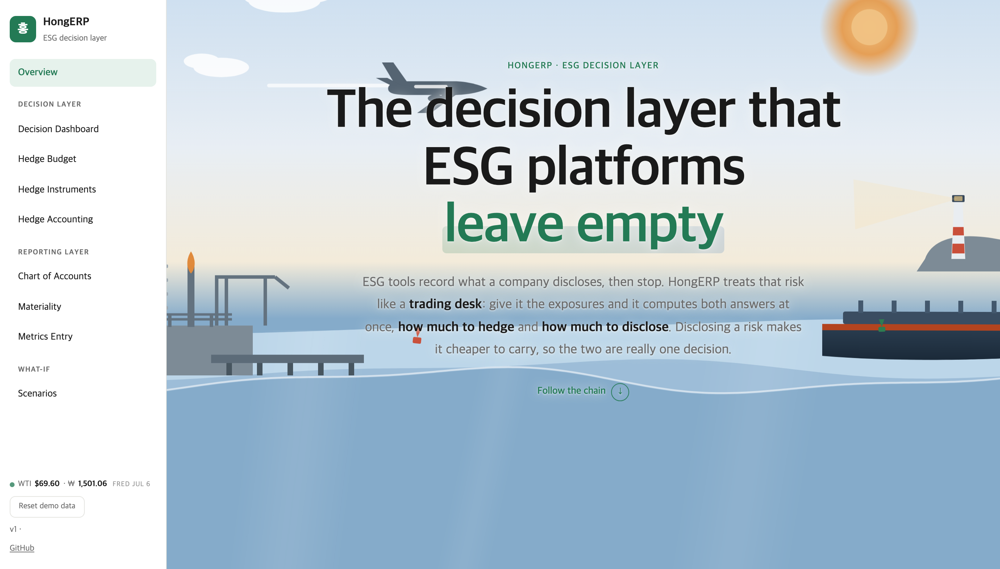
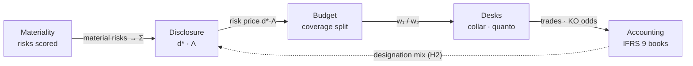
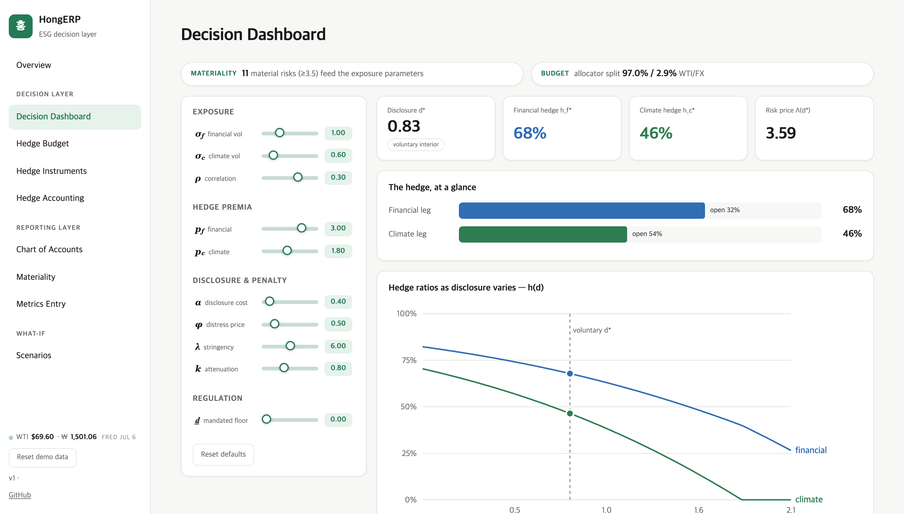

<div align="center">

# HongERP

### The decision layer that ESG platforms leave empty.

Most ESG software records what a company discloses and stops there. **HongERP treats that risk like a trading desk** — give it a company's exposures and it computes two answers at once: *how much to hedge* and *how much to disclose*. Four research papers were reduced to frozen computational engines; an ERP-grade governance shell (roles, ledgers, approvals, an audit trail) runs on top of them, entirely in the browser.

**[▶ Open the live app](https://jihongparker.github.io/hong-erp/)**  ·  no login, no finance background needed



</div>

---

## What kind of project this is

Not a web app with finance-flavoured labels, and not a slide deck with a demo attached: **a finance-literate system design**. The hard part is neither the React nor the math in isolation — it is that the accounting semantics (segregation of duties, append-only audit trail, period locks, IFRS 9 designation) and the quantitative engines (constrained optimization, barrier-option surfaces, a disclosure–hedging equilibrium) are one connected state machine, and every number on screen can name where it came from.

| Proof, not adjectives | |
| --- | --- |
| Equilibrium engine vs independent minimizer | gap ≤ 3×10⁻⁶ over 200 draws (in CI) |
| Zero-cost collar solver | put–call parity to 1×10⁻¹⁴ |
| Exotic barrier surface | knock-out rate 43.5% vs 43.7% paper anchor |
| Hedge backtest | 486 months of FRED data (60-month warm-up, 426 evaluated), walk-forward, past-only |
| Governance flows | submit → approve → book → designate, Playwright-tested end to end |

## The system in one diagram

The sidebar is not a menu; it is this graph. One firm-level position is shared by every screen, and the loop closes: the disclosure problem prices residual risk (Λ), everything downstream trades at that price, and the hedge-accounting election flows back as the outcome the disclosure research measures.



Architecture in depth — layer map, permission matrix, ledger schema, verification chain: **[docs/ARCHITECTURE.md](docs/ARCHITECTURE.md)**.

## What's inside

| Module | What it does |
| --- | --- |
| **Decision Dashboard** | Optimal disclosure *d\** and hedge ratios *h\** solved live; shows how forced disclosure crowds out hedging |
| **Hedge Budget** | Splits a fixed premium budget across the oil and currency legs (constrained min-variance) |
| **Hedge Instruments** | Zero-cost collar desk (Black-76) and a double-knock-out quanto barrier monitor |
| **Hedge Accounting** | IFRS 9 cash-flow-hedge designation: combined vs split, with OCI and ineffectiveness ledgers |
| **Materiality** | Interactive double-materiality matrix from an IRO register |
| **Metrics Entry** | Submit → validate → approval queue → ledger, with an audit trail and FY close |
| **Chart of Accounts** | Sustainability account tree mapped to GRI / KSSB / KCGS / MSCI datapoints |
| **Scenarios · Backtest** | Division-level parameters; 40-year walk-forward hedge backtest on real data |

<div align="center">



</div>

## Engineering notes

- **Client-only architecture.** All computation lives in `src/engine/*`; the UI is a thin, reactive layer over pure functions. Governance (role gates, append-only trail, period locks) is enforced in the reducers — a design property, not an infrastructure purchase.
- **Numerical trust.** `scripts/verify-engine.mjs` re-solves the equilibrium against an independent optimizer on every CI run; precomputed option surfaces carry their calibration and anchor checks in-file.
- **Live data, zero backend.** A scheduled GitHub Action pulls WTI and USD/KRW from FRED each weekday and commits a snapshot; the app opens on the latest close, with the secret held server-side.
- **Designed, not just built.** Hand-drawn animated hero, guided tour, EN/KO bilingual copy, full light/dark theming, responsive to mobile, `prefers-reduced-motion` support throughout. No chart library, no state library, no CSS framework.

**Stack** — React 18 · TypeScript · Vite · hand-built SVG/Canvas · React Context · GitHub Actions (data pipeline, CI, Pages) · Playwright.

## 한국어 소개

HongERP는 ESG 플랫폼이 비워 둔 **의사결정 층**을 채우는 프로토타입입니다. 기존 도구가 "무엇을 공시했는가"를 기록하는 데서 멈춘다면, 이 시스템은 회사의 위험 노출을 입력받아 **얼마나 헤지하고 얼마나 공시할지**를 함께 계산합니다.

겉모습은 ERP지만 속은 두 겹입니다. 아래층에는 연구 논문 네 편의 결과를 그대로 옮겨 고정한 계산 엔진(예산 배분, 배리어 옵션 가격 산정, 현금흐름위험회피 원장, 공시-헤지 균형)이 있고, 위층에는 실제 결재선을 본뜬 통제 구조가 있습니다 — 사업부장이 지표를 **상신**하면 감사팀이 **승인·반려**하고, 자금부가 파생상품을 **체결**하며, CFO가 회계 **지정**과 **기말 마감**을 맡습니다. 모든 처리 내역은 지울 수 없는 감사 기록으로 남고, 수치를 올린 사람이 그 수치를 승인할 수 없도록 권한이 분리되어 있습니다.

화면 아홉 개는 하나의 포지션을 공유합니다. 중대성 평가에서 확정된 위험이 공시 문제로 넘어가 **위험의 가격(Λ)** 을 정하고, 예산과 데스크가 그 가격에 맞춰 움직이며, 장부의 지정 결과는 다시 공시 문제의 결과변수로 되돌아옵니다. 모든 핵심 수치는 독립 검증을 거칩니다 — 균형 엔진은 별도 최적화기와 200회 대조(오차 3×10⁻⁶ 이하), 옵션 가격은 풋-콜 패리티 10⁻¹⁴ 수준, 백테스트는 실제 유가·환율 40년치로 매달 재계산됩니다.

## Run it locally

```bash
npm install
npm run dev      # http://localhost:5173
npm run build    # production build to dist/
```

## Grounding

The models aren't decorative. Each module implements the actual result from a four-part research program on one economic position — a Korean crude-oil importer's joint WTI × USD/KRW exposure — spanning budget allocation, dynamic hedging of an exotic barrier option, IFRS 9 hedge accounting, and the effect of mandatory ESG disclosure on hedging. The product's job is to make those results something you can *touch*. Figures shown are illustrative, and no real firm's branding is used.

<div align="center">
<br>
<a href="https://jihongparker.github.io/hong-erp/"><b>Open the live app →</b></a>
</div>
