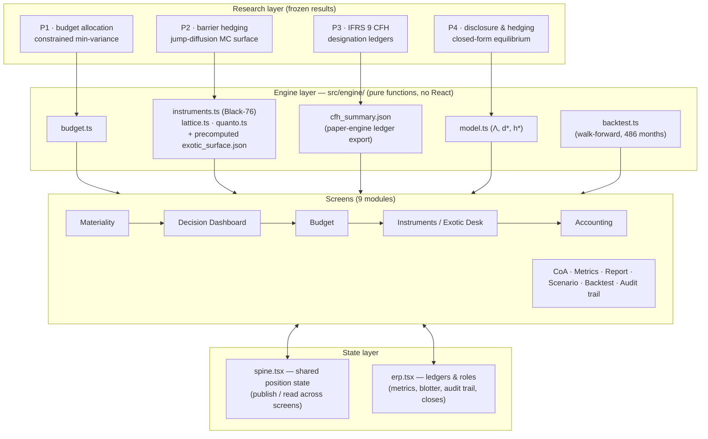
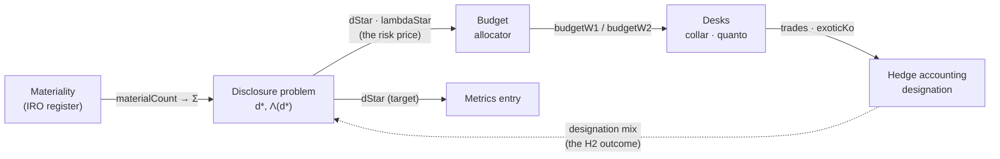

# HongERP — Architecture

This document is the engine room. The [README](../README.md) says what the product shows; this says what it is made of: the layer map, the shared position state, the segregation-of-duties model, the data schema, and the verification chain. Everything below runs client-side — there is no backend.

## 1. The layer map

Four research papers were each reduced to a frozen computational engine; nine screens consume those engines through one shared position state.

Engines are **frozen**: `model.ts` is a line-by-line transcription of the paper's equations, `exotic_surface.json` is precomputed by the paper's own Monte Carlo (`modeling/python/02_delta/export_erp_surface.py`) under the paper calibration. The UI can move *observable state* (spot, FX) but never the calibration. That boundary — live market state on top of frozen research parameters — is deliberate and enforced by construction: the surface is data, not code.

## 2. The position spine (data flow)

One firm-level position is shared by every screen through `src/state/spine.tsx` — a publish/read context. The sidebar order is a rendering of this graph. Labels on the arrows are the actual state fields.

The loop is the point: the disclosure problem prices residual risk (Λ), every layer downstream trades at that price, and the hedge-accounting election flows back as the outcome variable the disclosure research measures. Each screen renders provenance chips ("BUDGET · allocator split 97.0 / 2.9") so a number's origin is always one glance away.

## 3. Segregation of duties

Four roles gate every state-changing action. The gates are enforced in the reducers, not just hidden in the UI — a disabled button is a courtesy; the dispatch guard is the control.

| Action | Division head | Treasury desk | Audit | CFO |
| --- | :-: | :-: | :-: | :-: |
| Submit a metric (상신) | ✓ | – | – | – |
| Approve / reject (승인·반려) | – | – | ✓ | – |
| Book a trade (체결) | – | ✓ | – | – |
| Designate CFH-A / CFH-B / FVTPL (지정) | – | – | – | ✓ |
| Close a fiscal year (기말 마감) | – | – | – | ✓ |
| Bulk CSV import | ✓ | – | – | – |

No single role can both file a figure and sign it off; nothing reaches the model unsigned. A fiscal-year close locks its period — corrections after close must be booked as new events, never edits to history.

## 4. Data schema

`src/state/erp.tsx` is the ledger layer (client-side; persisted to `localStorage` under a versioned key, `hongerp-v1`).

| Store | Shape | Rules |
| --- | --- | --- |
| `divisions` | id, name, head, model params per division | Scenario edits persist and flow to the Dashboard's division book |
| `metrics` | datapoint, FY, value, submitter, ts, `pending → approved / rejected` | duplicate pending submissions are no-ops; approved values feed d* |
| `trades` | instrument, terms, notional, booked-by, ts, designation | 40-row cap; 5-second duplicate-booking guard; designation is mutable only by the CFO |
| `events` | actor, action, detail, ts | append-only — the audit trail renders this store verbatim |
| `closes` | FY, closedAt, signed-off counts | one close per year, irreversible in-app |

The metric taxonomy (`src/data/taxonomy.ts`) is a hierarchical account tree — 65 datapoints mapped to GRI / KSSB / KCGS / MSCI at the datapoint level — and the IRO register (`src/data/iro.ts`) feeds the double-materiality matrix.

## 5. Verification chain

Every headline number is checked by an independent path before it ships.

| Layer | Check | Where |
| --- | --- | --- |
| Equilibrium engine | closed form vs multi-start numeric minimizer, 200 draws, gap ≤ 3×10⁻⁶ | `scripts/verify-engine.mjs`, CI (`verify.yml`) |
| Collar solver | put–call parity to 1×10⁻¹⁴; zero-cost residual at solver root | `scripts/verify-engine.mjs` |
| Exotic surface | knock-out rate 43.5% vs paper anchor 43.7%; homogeneity rescale for live FX | anchors stored in-file with the surface |
| CFH ledgers | A-vs-B ineffectiveness ratio against the paper engine's export | `scripts/verify-cfh.mjs` |
| Backtest | walk-forward on 486 months of FRED data, monthly auto-refresh | `backtest.yml` + in-browser re-run |
| UI flows | submit → approve → book → designate → reload persistence, end to end | Playwright (`scripts/shot-*.mjs`) |

Market data: `market.yml` (weekday cron) pulls WTI and USD/KRW from FRED, commits a snapshot, and dispatches the Pages deploy — the API key lives in repo secrets and never reaches the client.

## 6. Constraints that shaped the design

- **Client-only.** No backend, no database server: the ledger semantics (append-only trail, period locks, role gates) are implemented in reducers over a persisted store. The point is that governance is a *design property*, not an infrastructure purchase.
- **No chart, state, or CSS frameworks.** Every visualization is hand-built SVG; state is React context; styling is plain CSS with light/dark theming and `prefers-reduced-motion` fallbacks throughout.
- **Two languages, one source of truth.** English strings in the JSX are the keys; the Korean layer (`i18n.ts` + per-layer dictionaries) is a pure dictionary lookup with inline branches only where live numbers interleave.
